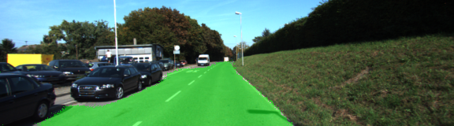
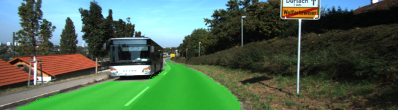
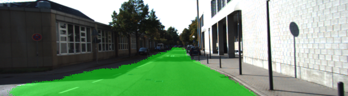

# Semantic Segmentation
### Introduction
In this project, the goal is to label the pixels of a road in images using a Fully Convolutional Network (FCN) as described in the [Fully Convolutional Networks For Semantic Segmentation](https://arxiv.org/pdf/1605.06211.pdf). The project is based on Udacity starter project and the guide in the Project Q&A.

### Build the Neural Network
#### Load Pretrained VGG Model into TensorFlow
```python
def load_vgg(sess, vgg_path):
    """
    Load Pretrained VGG Model into TensorFlow.
    :param sess: TensorFlow Session
    :param vgg_path: Path to vgg folder, containing "variables/" and "saved_model.pb"
    :return: Tuple of Tensors from VGG model (image_input, keep_prob, layer3_out, layer4_out, layer7_out)
    """
    # TODO: Implement function
    #   Use tf.saved_model.loader.load to load the model and weights
    vgg_tag = 'vgg16'
    vgg_input_tensor_name = 'image_input:0'
    vgg_keep_prob_tensor_name = 'keep_prob:0'
    vgg_layer3_out_tensor_name = 'layer3_out:0'
    vgg_layer4_out_tensor_name = 'layer4_out:0'
    vgg_layer7_out_tensor_name = 'layer7_out:0'
    tf.saved_model.loader.load(sess, [vgg_tag], vgg_path)
    graph = tf.get_default_graph()
    w1 = graph.get_tensor_by_name(vgg_input_tensor_name)
    keep = graph.get_tensor_by_name(vgg_keep_prob_tensor_name)
    layer3_out = graph.get_tensor_by_name(vgg_layer3_out_tensor_name)
    layer4_out = graph.get_tensor_by_name(vgg_layer4_out_tensor_name)
    layer7_out = graph.get_tensor_by_name(vgg_layer7_out_tensor_name)
    return w1, keep, layer3_out, layer4_out, layer7_out
```
#### Create the layers for a fully convolutional network
The layers() function on the main.py create the layers for a fully convolutional network from the vgg layers.

#### Optimize the neural network
The optimize() function builds the TensorFlow loss and optimizer operation
```python
def optimize(nn_last_layer, correct_label, learning_rate, num_classes):
    """
    Build the TensorFLow loss and optimizer operations.
    :param nn_last_layer: TF Tensor of the last layer in the neural network
    :param correct_label: TF Placeholder for the correct label image
    :param learning_rate: TF Placeholder for the learning rate
    :param num_classes: Number of classes to classify
    :return: Tuple of (logits, train_op, cross_entropy_loss)
    """
    # TODO: Implement function
    logits = tf.reshape(nn_last_layer, (-1, num_classes))
    correct_label = tf.reshape(correct_label, (-1, num_classes))
    
    cross_entropy_loss = tf.reduce_mean(tf.nn.softmax_cross_entropy_with_logits(logits=logits, labels = correct_label))
    
    optimizer = tf.train.AdamOptimizer(learning_rate=learning_rate)
    
    train_op = optimizer.minimize(cross_entropy_loss)
    return logits, train_op, cross_entropy_loss
```

#### Train the neural network function
```python
def train_nn(sess, epochs, batch_size, get_batches_fn, train_op, cross_entropy_loss, input_image,
             correct_label, keep_prob, learning_rate):
    """
    Train neural network and print out the loss during training.
    :param sess: TF Session
    :param epochs: Number of epochs
    :param batch_size: Batch size
    :param get_batches_fn: Function to get batches of training data.  Call using get_batches_fn(batch_size)
    :param train_op: TF Operation to train the neural network
    :param cross_entropy_loss: TF Tensor for the amount of loss
    :param input_image: TF Placeholder for input images
    :param correct_label: TF Placeholder for label images
    :param keep_prob: TF Placeholder for dropout keep probability
    :param learning_rate: TF Placeholder for learning rate
    """
    # TODO: Implement function
    sess.run(tf.global_variables_initializer())
    
    print('Training for {} epochs '.format(epochs))
    print()
    
    for epoch in range(epochs):
        print('Epoch : {}'.format(epoch + 1))
        loss_log = []
        for image, label in get_batches_fn(batch_size):
            _, loss = sess.run([train_op, cross_entropy_loss],
                               feed_dict={
                                   input_image: image,
                                   correct_label:label,
                                   keep_prob:0.5,
                                   learning_rate:0.00001
                               }
                               )
            loss_log.append('{:3f}'.format(loss))
        print(loss_log)
        print()
    
    print('Training finished')
```

### Neural Network Training
#### Hyperparameters turning
I have tried the learning rate is 0.00001, batch size: 5 and number of epochs: 12, 24, 36 and 48. In overal, the loss keeps decrease over time.
When the number of epochs is 12, the loss is descreased to about 0.11. The output images are not good enough with a lot of noise.
When the number of epochs is 24, the loss is descreased to about 0.08. The output images are better but still has a lot of error.
The loss is about 0.05 with 36 epochs. The output images has some noise.
The loss is about 0.03 with 48 epochs. The output images are much better with only small error. It's my choosen parameters.

#### The output images result
Please check the output images at [runs/1546888348.5408664](./runs/1546888348.5408664) folder for more detail. Below are some sample images



